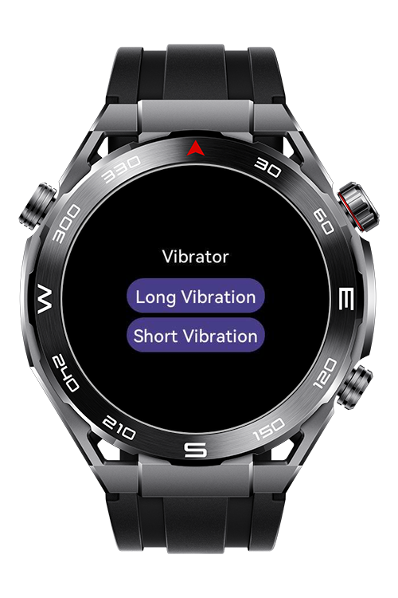

> **Note:** To access all shared projects, get information about environment setup, and view other guides, please visit [Explore-In-HMOS-Wearable Index](https://github.com/Explore-In-HMOS-Wearable/hmos-index).

# How to use Vibrator?

This application provide you can learn how to use vibrator for Huawei Sport Watch models.

# Preview

<p style="align: left;">
  
</p>

# Use Cases

- Keep screen on when your application is waiting some event

# Tech Stack

- **Languages**: JS
- **Frameworks**: HarmonyOS SDK "4.0.0(10)"
- **Tools**: DevEco Studio Vers 5.1.0.842
- **Libraries**: @system.vibrator

# Directory Structure
```
 config.json
│
├───js
│   └───MainAbility
│       │   app.js
│       │
│       ├───i18n
│       │       en-US.json
│       │       zh-CN.json
│       │
│       └───pages
│           └───index
│                   index.css
│                   index.hml
│                   index.js
│
└───resources
    └───base
        ├───element
        │       string.json
        │
        └───media
                icon.png
                icon_small.png

```

# Constraints and Restrictions

## Supported Devices

- Huawei Sport (Lite) Watch GT 4/5/6
- Huawei Sport (Lite) GT4/5 Pro
- Huawei Sport (Lite) Fit 3/4
- Huawei Sport (Lite) D2
- Huawei Sport (Lite) Ultimate

# LICENSE

This app is distributed under the terms of the MIT License.
See the [LICENSE](/LICENSE) for more information.
